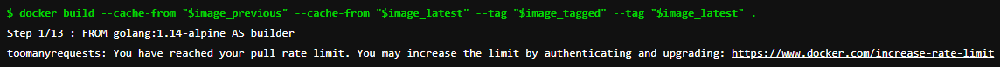

Things shifted slightly in the Cloud Native world a while back, when the Docker Hub turned on [rate limiting](https://www.docker.com/blog/what-you-need-to-know-about-upcoming-docker-hub-rate-limiting/). If you run a Kubernetes cluster or Gitlab pipelines, or make extensive use of Docker images or Docker build, this is something you need to be aware of as it could cause outages.

Docker pull comes with a limit of pull which is 100 requests per 6 hours, so if your pipeline pulls more than that limit you will encounter the pull limit error from docker.

> toomanyrequests: You have reached your pull rate limit. You may increase the limit by authenticating and upgrading: https://www.docker.com/increase-rate-limit



Prerequisites:

- SSH to Gitlab Runner Machine
- Article assumes that you have an understanding of docker
- Your GitLab runner executor is docker

### To resolve the error we have two approaches:

1. Use a free docker account that comes with a 200 request per 6 hours limit or a paid docker account. this is fairly simple and requires only `docker login` before pulling an image

    ```sh
    echo $DOCKER_PASSWORD | docker login -u $DOCKER_USER --password-stdin
    docker build .
    ```

2. Set policy to your GitLab runner to pull if not present

    Pull policy will always first look for the already present image and will use it if present otherwise falls back to docker pull.

    ```sh
    [runners.docker]
      tls_verify = false
      image = "docker:dind"
      privileged = true
      disable_entrypoint_overwrite = false
      oom_kill_disable = false
      disable_cache = false
      volumes = ["/cache"]
      shm_size = 0
      tls_cert_path = ""
      pull_policy = "if-not-present"
    ```

This works great but what if you build a docker image inside your docker executor (docker inside docker), docker build will not be able to find out the images that are available on your runner machine because we are executing the build inside a docker container.

One way would be to solve this by using the docker private registry.

### Setting up docker private registry:

1. SSH to the runner machine
2. Start a registry container
   
    Use the following to start the registry container:

    ```bash
    docker run -d -p 5000:5000 --restart=always --name registry registry:2
    ```

3. Copy an image from Docker Hub to your registry
   
    You can pull an image from Docker Hub and push it to your local registry. The following example pulls the golang alpine image from Docker Hub and then pushes it to the local registry.

    ```bash
    docker pull golang:1.16-alpine
    ```

    Tag the image as localhost:5000/golang:1.16-alpine. This creates an additional tag for the existing image. When the first part of the tag is a hostname and port, Docker interprets this as a registry location when pushing.

    ```bash
    docker tag golang:1.16-alpine localhost:5000/golang:1.16-alpine
    ```

    Push the image to the local registry running at localhost:5000:

    ```bash
    docker push localhost:5000/golang:1.16-alpine
    ```

> You should not expose your local registry to the internet for security reasons, we will be using the private IP of your runner's machine to access this private registry inside the Docker executor

4. Update entry-point of `.gitlab-ci.yml` file

    Update your `.gitlab-ci.yml` file to allow the insecure local registry, following is an example:

    ```yaml
    build:
      stage: build
      image: docker:20.10.5
      tags:
      services:
        - name: docker:20.10.5-dind
          command: ["--insecure-registry=<PRIVATE_IP_ADDRESS>:5000"]
      variables:
        DOCKER_HOST: tcp://docker:2375/
        DOCKER_DRIVER: overlay2
        DOCKER_TLS_CERTDIR: ""
    ```

5. Pull image from the local registry before building docker image:

    Following in the `.gitlab-ci.yml` file would pull the golang alpine image from the local registry and then tag it.

    ```yaml
    before_script:
      - docker pull <PRIVATE_IP_ADDRESS>:5000/golang:1.16-alpine
      - docker tag <PRIVATE_IP_ADDRESS>:5000/golang:1.16-alpine golang:1.16-alpine
    ```

    Now your `docker build` command should use this locally pulled image instead of pulling from Docker Hub. You may validate it by verifying the image version in your `Dockerfile`

    ```yaml
    FROM golang:1.16-alpine AS builder
    ```

### Limitation of the local registry approach:

Your CI file needs to be updated to pull the image from the local registry, which might cause issues if you have multiple GitLab runners running or configured.

I hope you find this helpful. You can provide feedback or suggestions in the comment section below. Cheers!!!
