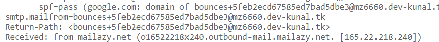
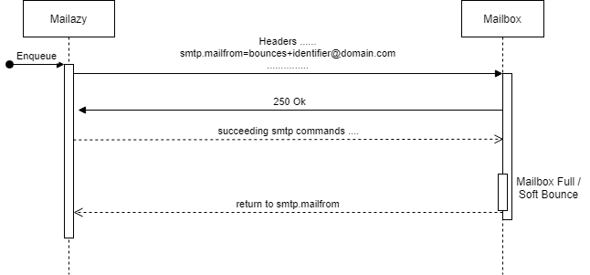

The Return-Path (sometimes called the Reverse-Path or Envelope-FROM — all of these terms can be used interchangeably) is the value used during the SMTP session.

Only the recipient’s mail server is supposed to add a Return-Path header to the top of the email. This records the actual Return-Path sender during the SMTP session. All bounces that occur during the SMTP session should go back to the Return-Path value. Some servers may accept all email and then queue them locally until it has a free thread to deliver them to the recipient’s mailbox. If the recipient doesn’t exist, it should bounce it back to the recorded Return-Path value. Note, not all mail servers obey this rule. Some mail servers will bounce it back to the 
FROM address.

In more simplified terms, When an email doesn’t make it to its intended destination, the return path indicates where non-delivery receipts—or bounce messages—are to be sent.
The return path may also be referred to as bounce address, reverse path, envelope from, MAIL FROM (and quite a few more).

the Return-Path header is added by the receiving mail server and not by the sender. You can write whatever address you want inside of the envelope, but to deliver it you have to take it to the post office and show them your ID and they put that address on the envelope before sending it. In other words, the Return-Path header is as trustworthy as the checks performed by the receiving SMTP server, where the others can be easily spoofed.

"MAIL FROM" is just the more technically-correct way of saying Return-Path; they're the same thing.